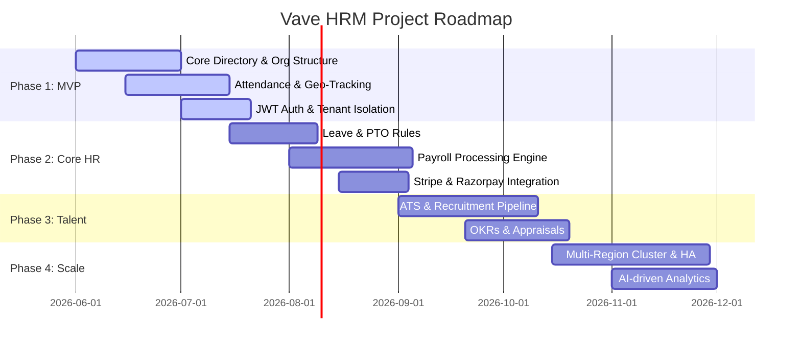

# Development Roadmap

This document outlines the milestones and release timeline for Vave HRM from initial prototype to enterprise-ready SaaS.

## Milestone Details

### Milestone 1: Minimum Viable Product (MVP)
- **Goal:** Launch basic core HR features to secure initial beta users.
- **Key Deliverables:**
  - Multi-tenant PostgreSQL separation logic.
  - Basic Employee database with organization/branch tree schema.
  - Mobile-responsive Clock-in/Clock-out system with location tagging.
  - Administrative UI console.

### Milestone 2: Enterprise Core & Monetization
- **Goal:** Commercialize the product and add critical transactional processing.
- **Key Deliverables:**
  - Robust rule engine for Leave and Holiday policies.
  - Automated Payroll processing based on attendance metrics.
  - Subscription setup supporting tiered pricing.

### Milestone 3: ATS & Performance Tracking
- **Goal:** Expand system footprint to cover the entire employee lifecycle.
- **Key Deliverables:**
  - Applicant Tracking System with custom pipeline states.
  - Goal tracking (OKRs) and semi-annual performance reviews.

### Milestone 4: Scaling & Compliance
- **Goal:** Enterprise security alignment, custom integrations, and AI features.
- **Key Deliverables:**
  - SOC2 Compliance Auditing logs.
  - Custom API Integrations marketplace (Slack, Teams, QuickBooks).
