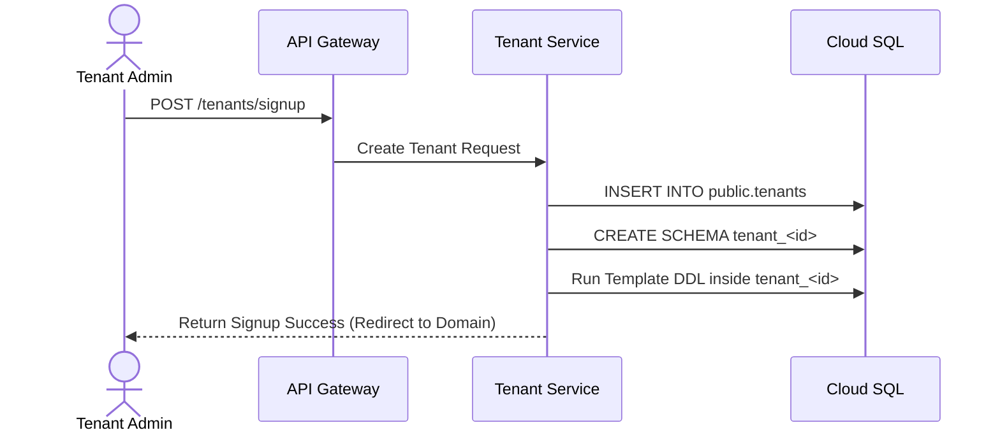
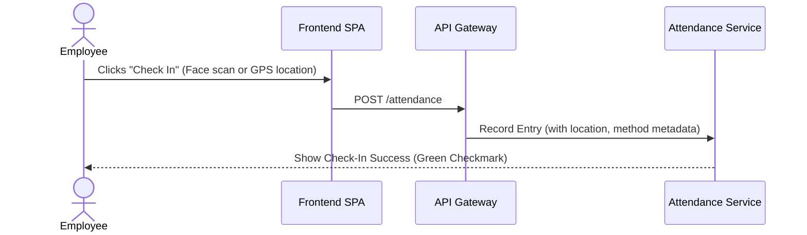
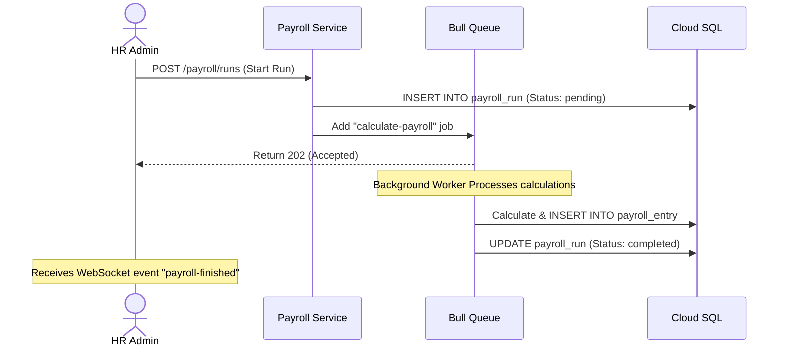

# Key User Journey Flows

This document details the main user flows through the Vave HRM platform.

## 1. Tenant Sign-Up & Onboarding

## 2. Employee Daily Attendance Check-In

## 3. Automated Payroll Processing Flow

